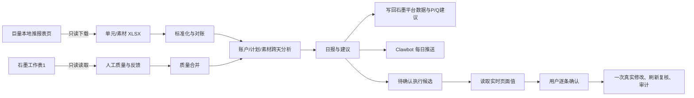

# 本地推运营 Agent V1

**版本状态：V1 / 2026-09-16**  
**账户：部署时在本机配置的巨量本地推账户**

## 1. V1 是什么

这是一个面向巨量本地推账户的日常运营 Agent。它把每日平台投放明细、石墨中的人工线索质量结果和固定风控规则放入同一条链路，输出可追溯的日报、判断和候选动作。

它解决的是“每天先拿到可信数据，再说清楚哪里有问题、为什么有问题、下一步是否值得动预算”的问题，而不是自动替人投放。

V1 的职责分为四层：

1. **数据层**：从巨量报表页面下载单元和素材明细；从石墨读取有效留资、已对接和执行反馈。
2. **分析层**：汇总账户、计划和素材的消耗、点击、平台留资、CTR、CPL、转化率及跨天变化。
3. **决策层**：用固定规则生成观察、核查、降预算或暂停候选，并写明证据、缺失证据和限制。
4. **执行控制层**：把候选转换成具体且需确认的动作。真实修改前必须读取页面实时值、展示原值与目标值、等待用户逐条确认，并保留截图和审计记录。

## 2. 数据口径与来源

两类数据各有明确职责，不能互相替代：

| 数据 | 权威来源 | 用途 |
|---|---|---|
| 计划、素材、消耗、曝光、点击、平台留资 | 巨量本地推导出的单元/素材分日明细 | 计划与素材表现、平台 CPL、预算/暂停规则证据 |
| 有效留资、已对接、人工执行反馈 | 石墨文档“抖音本地推数据”/“工作表1” | 线索质量、有效 CPL、对接成本、动作效果复盘 |

石墨表中，平台数据写入 B/C/G/H/K；E/M 由人工维护有效留资和已对接；公式列保留。P/Q 是 Agent 的建议列，R:W 是人工执行反馈列。

计划或素材层的有效留资必须有可验证的归因关系后才能使用。当前石墨只提供账户日粒度的质量数据，因此可以判断账户质量，但不能把某日有效留资直接分给具体计划或素材。

## 3. 运行架构



### 3.1 每日主链路

入口为 `src/daily_job.py`。正常运行顺序是：

1. 用项目专用 Chrome Profile 打开巨量报表页，只读下载昨日的单元与素材报表。
2. 验证文件存在、非空、表头可识别，并对账两份报表的消耗、曝光、点击、留资和私信总量。
3. 读取石墨当天的有效留资和已对接字段，合并账户级质量指标。
4. 加载本账户之前的成功运行记录，形成三日和历史窗口的跨天分析。
5. 生成 `daily_report.json`、Markdown 日报、建议、待确认动作和运行清单。
6. 回写石墨当天平台列与 P/Q 建议列，保留人工列和公式列。
7. 把带判断的日报推送至 Clawbot。

当日运行工件放在 `outputs/daily_reports/YYYY-MM-DD/`。其中 `run_manifest.json` 是数据来源凭据，`daily_report.json` 是结构化结果，`recommendations.json` 是建议，`pending_execution_actions.json` 是只能继续准备、不能直接执行的候选。

### 3.2 跨天复盘

月度或指定时间段可下载巨量的分日计划/素材明细，并读取同日期石墨质量字段后生成合并复盘。2026 年 9 月 1–15 日的首份结果位于：

- `outputs/month_review/2026-09/combined_review.md`
- `outputs/month_review/2026-09/combined_review.json`

这类复盘的原则是：巨量用于计划和素材判断，石墨用于质量判断；没有计划级质量归因时，不把账户有效留资伪装成计划有效留资。

## 4. V1 决策与风控规则

规则由 `execution_policy.json` 固化，不能由日报或模型输出绕过：

- 每次预算修改幅度最多 **10%**。
- 单日异常只能提出**降预算**候选，不能提出暂停。
- 只有同一计划连续三个自然日每天有消耗且每天平台留资为 0，才可提出暂停候选。
- 所有真实动作都要求用户对该条具体动作明确确认。
- 未实现、未授权的操作包括开启计划、修改出价、修改素材和删除。

候选不是执行权限。执行动作的流程固定为：

1. 从正式日报的 `pending_execution_actions.json` 选择一条候选。
2. `prepare` 只读后台，绑定账户、项目、实时预算/状态和精确目标值，生成 `act_...` 动作 ID 与 SHA256 指纹。
3. 向用户展示计划名称、原值、目标值、证据、动作 ID 和完整指纹。
4. 用户在聊天中明确确认该条动作后，才允许 `approve`。
5. `execute` 再读取实时页面值；值变动、审批过期或页面不匹配时停止，不自动重试。
6. 执行后刷新复核，保留前后截图并写入 SQLite 审计。

## 5. 已完成并有运行证据的能力

### 数据与日报

- 已校准巨量报表页的单日下载，以及同月 1 日到指定结束日的日期选择器交互。
- 2026-09-15 已成功下载单元和素材报表；文件清单和统计日期记录在该日日报的 `run_manifest.json`。
- 单元和素材总量对账通过后才会生成正常日报和候选。
- 日报同时给出账户、计划、素材观察，并明确区分单日观察、数据缺口和可执行建议。

### 石墨与通知

- 已成功将 2026-09-15 平台数据写入石墨既有日期行，并刷新读回验证；人工字段和公式列保持不变。
- 已成功读取石墨 9 月 1–15 日的有效留资与已对接字段，作为跨天质量判断输入。
- Clawbot 日报推送已成功发送；推送正文包含数据判断、计划观察、素材观察和当天行动，不再只是汇总数字。

### 执行控制

- 已实现候选准备、审批、单次领取、实时值核验、过期控制、SQLite 审计及前后截图路径。
- 已完成计划页的**只读**校准：账户、项目名称/ID、预算、状态、预算编辑入口、单项目单元映射均有实际页面观察。
- 已确认一个项目可读取其唯一单元；这为后续计划级控制建立了映射验证基础。

## 6. 尚未验收或明确不做的范围

以下限制是 V1 的真实状态，不应描述成已完成：

1. **没有执行过真实预算调整或暂停。** `browser_execution_config.json` 的 `calibrated` 仍为 `false`，提交交互被代码硬性阻止。
2. 计划页的预算输入框和确认按钮已观察到，但“提交后的完整风险提示与落地复核”尚未完成校准；暂停开关也不能为校准而点击。
3. 当前计划—素材关系不在导出表中；素材表现不能反推出具体计划应该改预算。
4. 石墨的有效留资和已对接目前是账户日粒度；没有计划/素材级线索归因时，不能做计划级有效 CPL。
5. 已对接列尚未形成稳定填写，故不能计算对接成本或用其做效果归因。
6. 日报推送已成功，但长期的 Windows 定时任务稳定性仍需要继续观察。

## 7. 核心代码与职责

| 文件 | 作用 |
|---|---|
| `src/browser_downloader.py` | 打开已登录的巨量页面，只读导出单元/素材报表；包含真实日期选择器适配。 |
| `src/replay_core.py` | 标准化导出表、计算指标、对账、输出账户/计划/素材结构化日报。 |
| `src/history_context.py` | 合并当前账户正式历史，建立跨天窗口与异常证据。 |
| `src/recommendation_engine.py` | 将诊断转换成稳定、需人工确认的建议。 |
| `src/shimo_web_sheet.py` | 安全读取石墨人工质量字段，写入平台列及建议列并刷新核验。 |
| `src/daily_job.py` | 每日主编排：下载、分析、石墨同步、推送、状态保存。 |
| `src/clawbot_pusher.py` | 生成并发送含分析内容的 Clawbot 日报。 |
| `src/execution_policy.py` | 根据正式日报和规则生成待确认动作候选。 |
| `src/execution_controller.py` | 准备、审批、领取、执行审计与状态机。 |
| `src/browser_executor.py` | 计划页实时值读取、映射验证，以及受校准开关保护的执行适配器。 |
| `src/execute_action.py` | 执行控制层的 `prepare / approve / execute / show` 命令入口。 |

## 8. V1 的日常使用方式

每日任务由注册的 Windows 计划任务在 09:00 运行；也可在 `agent` 目录手动运行：

```powershell
& "C:\Users\EDY\.cache\codex-runtimes\codex-primary-runtime\dependencies\python\python.exe" `
  src\daily_job.py --browser-config browser_download_config.json
```

运行结束后优先查看：

1. `run_manifest.json`：下载时间、统计日期与文件清单是否正确。
2. `shimo_sync.json`：石墨写入与读回是否成功。
3. `clawbot_push.json`：日报是否推送成功。
4. `recommendations.json` 与 `pending_execution_actions.json`：是否出现建议或需确认候选。

如出现执行候选，先准备精确动作；不得直接执行候选 ID：

```text
src/execute_action.py prepare --candidate <pending_execution_actions.json> --candidate-id <exec_...> --target <例如 90.00 或 paused>
src/execute_action.py show --id <act_...>
```

只有用户确认对应 `act_...` 和完整 SHA256 指纹后，才允许继续审批和执行。

## 9. V1 验收标准

V1 达到“可日常使用”的标准是：每日能拿到可信导出、石墨同步不破坏人工数据、Clawbot 收到有判断的日报、异常有证据与边界、真实改动无法绕过逐条确认。

V1 尚未达到“可自动投放”的标准；在真实写操作完成页面校准、一次受控执行和复核前，它始终是**确认后执行**的运营 Agent。
